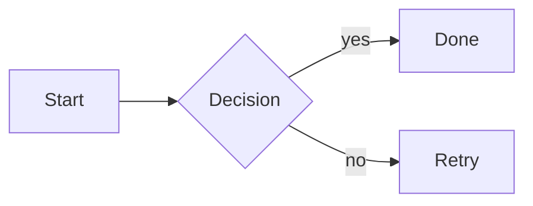

# Markdown Features

VertexMarkdown uses Python-Markdown with a curated extension set, plus two custom preprocessors (task lists, transclusion) and a JS bridge for interactive elements.

## Core extensions

| Extension | What it does |
|---|---|
| `fenced_code` | ` ```lang ` triple-backtick code blocks |
| `tables` | GFM-style pipe tables |
| `toc` | Heading anchor IDs via `slugify(text, '-')` |
| `codehilite` | Server-side Pygments highlighting |
| `sane_lists` | Stricter list parsing |
| `footnotes` | `[^1]` footnotes with auto-numbered reference section |
| `attr_list` | `{ #id .class key=val }` on any element |
| `md_in_html` | Parse markdown inside HTML blocks |
| `admonition` | `!!! note "Title"` callouts |
| `def_list` | Definition lists |
| `abbr` | `*[HTML]: HyperText Markup Language` abbreviations |

## Task checkboxes

```
- [ ] unchecked
- [x] checked
  - [ ] nested
```

Each task line is rewritten to an inline `<input type="checkbox" class="mv-task" data-task-line="N">` before rendering. Clicking a checkbox in the preview sends a JSON message back through the WebKit bridge; VertexMarkdown flips `[ ]` ↔ `[x]` in the source buffer (edit mode) or the file on disk (preview mode).

Task syntax inside fenced code blocks is left alone.

## Math (KaTeX)

Delimiters:

- Inline: `$x^2$` or `\(x^2\)`
- Display: `$$ \int_a^b f(x)\,dx $$` or `\[ ... \]`

Rendered client-side by KaTeX auto-render on each preview load. KaTeX is fetched from `cdn.jsdelivr.net/npm/katex@0.16.9`. Offline behaviour degrades to raw source. See the [roadmap](../../ROADMAP.md) for bundled offline KaTeX in 0.6.

## Mermaid diagrams

Use a fenced code block with `mermaid`:

````markdown

````

The bridge rewrites `<pre><code class="language-mermaid">` elements into `<div class="mermaid">` and calls `mermaid.run()`. Mermaid is fetched from `cdn.jsdelivr.net/npm/mermaid@10`.

Theme follows the editor theme (`dark` or `default`).

## Transclusion

Obsidian-style file or section embedding:

```markdown
![[other-note]]
![[other-note#Specific section]]
```

Resolves relative to the current file's folder. `.md` extension is optional. Max embed depth is 4 to avoid cycles. The `#Section` suffix slices headings up to (but not including) the next heading at the same or higher level. Transclusion is applied *before* markdown parsing, so the inlined content is rendered with the outer document's style.

## Tables

```markdown
| Col A | Col B |
|-------|-------|
| 1     | 2     |
```

Plus:

- `Ctrl+V` on CSV/TSV clipboard → auto-converts to a table.
- Palette **Insert table…** → rows × columns dialog.

## Footnotes, def lists, admonitions

```markdown
Here's a claim.[^src]

[^src]: Source of claim.

Term
: Definition.

!!! note "Optional title"
    A boxed callout.
```

## Code blocks

- Fenced with ```` ``` ```` + language hint for syntax highlighting.
- Indented 4-spaces blocks also work (no language highlighting).
- Inline `` `code` ``.

## Custom CSS

Any CSS at `~/.config/vertexmarkdown/custom.css` is appended to the preview stylesheet on every render. Override anything from `style.css` (light/dark variables, typography, etc.). See [Configuration](Configuration.md#custom-css).

## Not supported (yet)

- MathML output (KaTeX HTML only).
- Raw HTML script tags other than the rendered KaTeX/Mermaid ones.
- Pandoc-specific extensions like citations `[@foo]` (use pandoc export instead).

